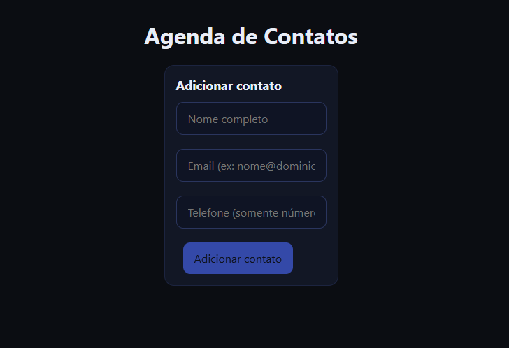

# 📇 Agenda de Contatos

Aplicação web para gerenciamento de contatos, com foco em organização de dados, performance e experiência do usuário.

Permite adicionar, editar e remover contatos de forma dinâmica, utilizando gerenciamento de estado global com Redux Toolkit.

---

## 🔗 Acesse o projeto

👉 https://lista-contatos-brown.vercel.app/

---

## 🚀 Tecnologias utilizadas

- React  
- Redux Toolkit  
- Styled Components  
- Vite  
- JavaScript  

---

## 📋 Funcionalidades

- Adicionar contatos  
- Editar contatos  
- Remover contatos  
- Gerenciamento de estado global com Redux  
- Interface responsiva e intuitiva  

Cada contato contém:
- Nome completo  
- Email  
- Telefone  

---

## 📸 Preview



---

## ▶️ Como executar o projeto

Clone o repositório:

```bash
git clone https://github.com/kaio-oliveira5/Lista-Contatos

Acesse a pasta:

cd Lista-Contatos

Instale as dependências:

npm install

Execute o projeto:

npm run dev
🌐 Deploy

Projeto publicado em ambiente real utilizando Vercel.

👨‍💻 Autor

Desenvolvido por Kaio Oliveira
